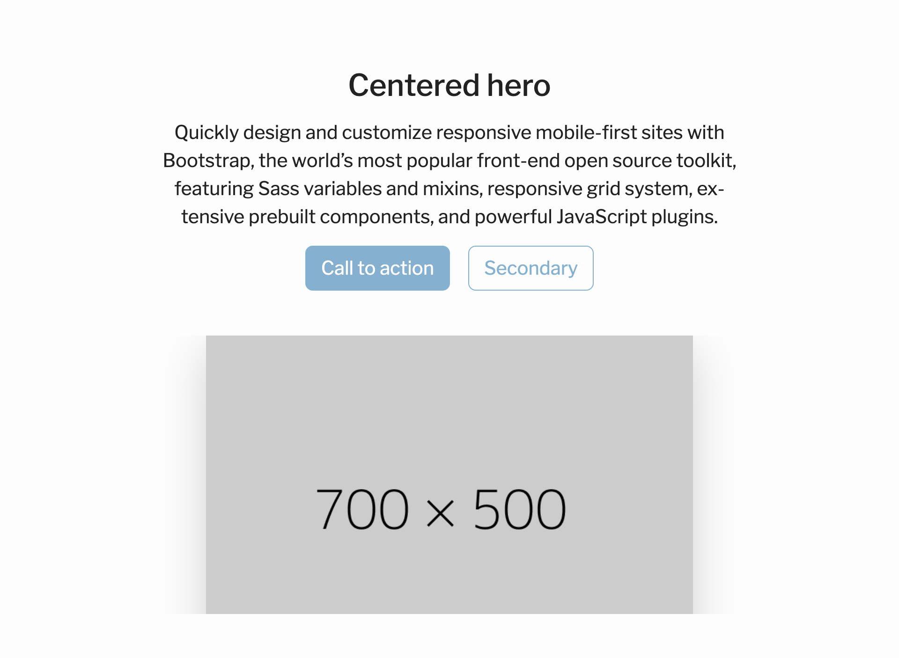

Name | Beschreibung
------------ | -------------
[Heroes](#heros) | Blöcke für den Start einer Unterseite
[Features](#features) | Blöcke für die Vermittlung von Werten und Vorteilen einer Korporation
[Galleries](#galleries) | Blöcke mit einem Fokus auf Bilder
[Social Proof](#social-proof) | Blöcke die zeigen, dass eine Korporation etwas taugen könnte
[Call to action](#call-to-action) | Blöcke um einen Besucher zu einer Handlung zu bewegen
[Misc](#misc) | Weitere Blöcke die nützlich sein könnten

## Heros

Name | Beschreibung
------------ | -------------
[`hero-centered-small-image`](#hero-centered-small-image) | Ein Block mit einem Kleinen Bild für z.B. den Zirkel
[`hero-centered-large-image`](#hero-centered-large-image) | Ein Block mit einem größeren Bild unterhalb der Überschrift
[`hero-right-image`](#hero-right-image) | Ein Block mit zwei Spalten. Links Text, rechts ein Bild
[`hero-right-contact`](#hero-right-contact) | Ein Block mit einer Überschrift und Text und einem Kontaktfomular

### hero-centered-small-image

Eine Hero-Sektion mit einem kleinen, zentrierten Bild. Gut geeignet für einen Zirkel oder ein kleines Wappen.

!!! note "TODO"

    Bild einfügen

**Beispiel:**
```json
{
  "id": "hero-centered-small-image",
  "imageUrl": "https://via.placeholder.com/150",
  "title": "Hero Title",
  "paragraph": "Hero paragraph",
  "primaryButtonText": "CTA Label",
  "primaryButtonUrl": "https://www.example.com",
  "secondaryButtonText": null,
  "secondaryButtonUrl": null
}
```

**Parameter:**

Name | Typ | Beschreibung
------------ | ------------- | -------------
`imageUrl` | `URL`, notwendig | URL des Bildes
`title` | `String`, notwendig | Titel des Hero-Bereichs
`paragraph` | `String`, notwendig | Beschreibungstext
`primaryButtonText` | `String`, notwendig | Text des primären Call-to-Action-Buttons
`primaryButtonUrl` | `URL`, notwendig | URL des primären Call-to-Action-Buttons
`secondaryButtonText` | `String`, optional | Text des sekundären Call-to-Action-Buttons
`secondaryButtonUrl` | `URL`, optional | URL des sekundären Call-to-Action-Buttons

---

### hero-centered-large-image

Eine Hero-Sektion mit einem großen, zentrierten Bild. Gut geeignet für ein Gruppenbild oder ein Bild vom Verbindungshaus.

Die nachfolgende Sektion sollte eine andere Hintergrundfarbe haben um einen korrekten Abschluss der Sektion zu gewährleisten.



**Beispiel:**
```json
{
  "id": "hero-centered-large-image",
  "imageUrl": "https://via.placeholder.com/150",
  "title": "Hero Title",
  "paragraph": "Hero paragraph",
  "primaryButtonText": "CTA Label",
  "primaryButtonUrl": "https://www.example.com",
  "secondaryButtonText": "CTA Label",
  "secondaryButtonUrl": "https://www.example.com"
}
```

**Parameter:**

Name | Typ | Beschreibung
------------ | ------------- | -------------
`imageUrl` | `URL`, notwendig | URL des Bildes
`title` | `String`, notwendig | Titel des Hero-Bereichs
`paragraph` | `String`, notwendig | Beschreibungstext
`primaryButtonText` | `String`, notwendig | Text des primären Call-to-Action-Buttons
`primaryButtonUrl` | `URL`, notwendig | URL des primären Call-to-Action-Buttons
`secondaryButtonText` | `String`, optional | Text des sekundären Call-to-Action-Buttons
`secondaryButtonUrl` | `URL`, optional | URL des sekundären Call-to-Action-Buttons

---

### hero-right-image

Eine Hero-Sektion mit zwei Spalten. Die linke Spalte zeigt Text und Buttons, die rechte Spalte ein Bild.

!!! note "TODO"

    Bild einfügen

**Beispiel:**
```json
{
  "id": "hero-right-image",
  "title": "Hallo Welt!",
  "paragraph": "Hero paragraph",
  "primaryButtonText": "CTA Label",
  "primaryButtonUrl": "https://www.example.com",
  "secondaryButtonText": "CTA Label",
  "secondaryButtonUrl": "https://www.example.com",
  "imageUrl": "https://via.placeholder.com/150"
}
```

**Parameter:**

Name | Typ | Beschreibung
------------ | ------------- | -------------
`imageUrl` | `URL`, notwendig | URL des Bildes
`title` | `String`, notwendig | Titel des Hero-Bereichs
`paragraph` | `String`, notwendig | Beschreibungstext
`primaryButtonText` | `String`, notwendig | Text des primären Call-to-Action-Buttons
`primaryButtonUrl` | `URL`, notwendig | URL des primären Call-to-Action-Buttons
`secondaryButtonText` | `String`, optional | Text des sekundären Call-to-Action-Buttons
`secondaryButtonUrl` | `URL`, optional | URL des sekundären Call-to-Action-Buttons

---

### hero-right-contact

Ein Hero-Sektion mit zwei Spalten. Die linke Spalte beinhaltet Text, die rechte Spalte ein Kontaktfomular.

!!! note "TODO"

    Bild einfügen

**Beispiel:**
```json
{
  "id": "hero-right-contact",
  "title": "Hallo Welt!",
  "paragraph": "Hero paragraph"
}
```

**Parameter:**

Name | Typ | Beschreibung
------------ | ------------- | -------------
`title` | `String`, notwendig | Titel des Hero-Bereichs
`paragraph` | `String`, notwendig | Beschreibungstext

## Features

Name | Beschreibung
------------ | -------------
[`features-hanging-icons`](#features-hanging-icons) | asd
[`features-cards`](#features-cards) | asd
[`features-checkmark-list`](#features-checkmark-list) | asd

### features-hanging-icons

Eine Feature Sektion welche unterhalb einer Überschrift und einem Absatz eine beliebige Anzahl von Einträgen mit Icon und optionalem Button anzeigt. Die Anzahl von Einträgen sollte durch 3 teilbar sein.

Verfügbare Icons können der [Fontawesome Dokumentation](https://fontawesome.com/v5/search?o=r&ic=free&s=regular) entnommen werden.

!!! note "TODO"

    Bild einfügen

**Beispiel:**
```json
{
  "id": "features-hanging-icons",
  "headline": "Some headline",
  "paragraph": "Demo paragraph",
  "entries": [
    {
      "icon": "",
      "headline": "Some headline",
      "paragraph": "Demo paragraph",
      "buttonText": "Mehr erfahren",
      "buttonUrl": "https://www.example.com"
    }
  ]
}
```

**Parameter:**

Name | Typ | Beschreibung
------------ | ------------- | -------------
`headline` | `String`, notwendig | Titel oberhalb der Entry-Liste
`paragraph` | `String`, notwendig | Beschreibungstext oberhalb der Entry-Liste
`entries` | `Array` von `Entry`, notwendig | Liste von Entries welche in 3 Spalten angezeigt werden

Entry Objekte müssen die folgende Form haben:

Name | Typ | Beschreibung
------------ | ------------- | -------------
`icon` | `String`, notwendig | Icon oberhalb des Entries
`headline` | `String`, notwendig | Titel des Entries
`paragraph` | `String`, notwendig | Beschreibungstext des Entries
`buttonText` | `String`, optional | Text für einen optional anzeigbaren Button
`buttonUrl` | `String`, optional | Link für einen optional anzeigbaren Button. `#` wenn nicht angegeben

### features-cards

!!! note "TODO"

    Bild einfügen

**Beispiel:**
```json
{
  "id": "features-cards",
  "headline": "Some headline",
  "paragraph": "Demo paragraph",
  "entries": [
    {
      "icon": "",
      "headline": "",
      "paragraph": "",
      "buttonText": "",
      "buttonUrl": ""
    }
  ]
}
```

**Parameter:**

Name | Typ | Beschreibung
------------ | ------------- | -------------
`headline` | `String`, notwendig | Titel oberhalb der Entry-Liste
`paragraph` | `String`, notwendig | Beschreibungstext oberhalb der Entry-Liste
`entries` | `Array` von `FeaturesCardEntry`, notwendig | Liste von Entries welche in 3 Spalten angezeigt werden

`FeaturesCardEntry` Objekte müssen die folgende Form haben:

Name | Typ | Beschreibung
------------ | ------------- | -------------
`icon` | `String`, notwendig | Icon für die Card
`headline` | `String`, notwendig | Headline für die Card
`paragraph` | `String`, notwendig | Beschreibungstext für die Card
`buttonText` | `String`, optional | Text für einen optional anzeigbaren Button
`buttonUrl` | `URL`, optional | Link für einen optional anzeigbaren Button. `#` wenn nicht angegeben


### features-checkmark-list

!!! note "TODO"

    Bild einfügen

**Beispiel:**
```json
{
  "id": "features-checkmark-list",
  "headline": "",
  "paragraph": "",
  "entries": [
    "",
    ""
  ],
  "buttonText": "",
  "buttonUrl": "",
  "imageUrl": ""
}
```

**Parameter:**

Name | Typ | Beschreibung
------------ | ------------- | -------------
`headline` | `String`, notwendig | Titel oberhalb der Entry-Liste
`paragraph` | `String`, notwendig | Beschreibungstext oberhalb der Entry-Liste
`entries` | `Array` von `String`, notwendig | Liste von Entries welche in 3 Spalten angezeigt werden
`buttonText` | `String`, optional | asd
`buttonUrl` | `URL`, optional | asd
'imageUrl` | `URL`, notwendig | asd

## Galleries

Name | Beschreibung
------------ | -------------
[`gallery-single-fluid`](#gallery-single-fluid) | Ein großed Bild über die Breite des restlichen Inhalts
[`gallery-single-with-text`](#gallery-single-with-text) | Ein Bild mit Text in zwei Spalten
[`gallery-triplet`](#gallery-triplet) | Ein Block mit einem großen Bild und zwei kleinen Bildern
[`gallery-quintet`](#gallery-quintet) | Ein Block mit einem großen Bild und vier kleinen Bildern
[`gallery-three-equals`](#gallery-three-equals) | Ein Block mit drei gleich großen Bildern und Beschreibungen pro Bild

### gallery-single-fluid

!!! note "TODO"

    Bild einfügen

**Beispiel:**
```json
{
  "id": "gallery-single-fluid",
  "imageUrl": ""
}
```

**Parameter:**

Name | Typ | Beschreibung
------------ | ------------- | -------------
`imageUrl` | `URL`, notwendig | asd

### gallery-single-with-text

!!! note "TODO"

    Bild einfügen

**Beispiel:**
```json
{
  "id": "gallery-single-with-text",
  "imageUrl": "",
  "headline": "",
  "paragraph": ""
}
```

**Parameter:**

Name | Typ | Beschreibung
------------ | ------------- | -------------
`headline` | `String`, notwendig | asd
`paragraph` | `String`, notwendig | ads
`imageUrl` | `URL`, notwendig | asd

### gallery-triplet

!!! note "TODO"

    Bild einfügen

**Beispiel:**
```json
{
  "prominentImageUrl": "",
  "topImageUrl": "",
  "bottomImageUrl": ""
}
```

**Parameter:**

Name | Typ | Beschreibung
------------ | ------------- | -------------
`prominentImageUrl` | `URL`, notwendig | asd
`topImageUrl` | `URL`, notwendig | ads
`bottomImageUrl` | `URL`, notwendig | asd

### gallery-quintet

!!! note "TODO"

    Bild einfügen

**Beispiel:**
```json
{
  "id": "gallery-quintet",
  "prominentImageUrl": "",
  "topstartImageUrl": "",
  "bottomstartImageUrl": "",
  "topRightImageUrl": "",
  "bottomRightImageUrl": ""
}
```

**Parameter:**

Name | Typ | Beschreibung
------------ | ------------- | -------------
`prominentImageUrl` | `URL`, notwendig | asd
`topstartImageUrl` | `URL`, notwendig | ads
`bottomstartImageUrl` | `URL`, notwendig | asd
`topRightImageUrl` | `URL`, notwendig | ads
`bottomRightImageUrl` | `URL`, notwendig | asd

### gallery-three-equals

!!! note "TODO"

    Bild einfügen

**Beispiel:**
```json
{
  "id": "gallery-three-equals",
  "headline": "",
  "paragraph": "",
  "image1": {
    "url": "",
    "paragraph": "",
    "title": ""
  },
  "image2": {
    "url": "",
    "paragraph": "",
    "title": ""
  },
  "image3": {
    "url": "",
    "paragraph": "",
    "title": ""
  }
}
```

**Parameter:**

Name | Typ | Beschreibung
------------ | ------------- | -------------
`headline` | `String`, notwendig | asd
`paragraph` | `String`, notwendig | ads
`image1` | `ThreeEqualsImage`, notwendig | asd
`image2` | `ThreeEqualsImage`, notwendig | ads
`image3` | `ThreeEqualsImage`, notwendig | asd

`ThreeEqualsImage` müssen der folgenden Form folgen:

Name | Typ | Beschreibung
------------ | ------------- | -------------
`title` | `String`, notwendig | asd
`paragraph` | `String`, notwendig | ads
`url` | `URL`, notwendig | asd

## Social Proof

Name | Beschreibung
------------ | -------------
[`statistics-with-explainer`](#statistics-with-explainer) | asd
[`statistics-strip`](#statistics-strip) | Ein Block mit 4 Kernwerten über die Korporation
[`quote-carousel`](#quote-carousel) | Ein Karousel mit Bild, Überschrift und Text pro Karouseleintrag
[`faq-accordion`](#faq-accordion) | Ein FAQ-Block mit aufklappbaren Fragen
[`faq-accordion-image`](#faq-accordion-image) | Ein FAQ-Block mit aufklappbaren Fragen und einem Bild

### statistics-with-explainer

!!! note "TODO"

    Bild einfügen

**Beispiel:**
```json
{
  "id": "statistics-with-explainer",
  "heading": "",
  "paragraph": "",
  "firstStat": {
    "value": "",
    "hint": ""
  },
  "secondStat": {
    "value": "",
    "hint": ""
  },
  "thirdStat": {
    "value": "",
    "hint": ""
  }
}
```

### statistics-strip

!!! note "TODO"

    Bild einfügen

**Beispiel:**
```json
{
  "id": "statistics-strip",
  "firstStat": {
    "value": "",
    "hint": ""
  },
  "secondStat": {
    "value": "",
    "hint": ""
  },
  "thirdStat": {
    "value": "",
    "hint": ""
  },
  "fourthStat": {
    "value": "",
    "hint": ""
  }
}
```

### quote-carousel

!!! note "TODO"

    Bild einfügen

**Beispiel:**
```json
{
  "id": "quote-carousel",
  "headline": "",
  "entries": [
    {
      "headline": "",
      "paragraph": "",
      "imageUrl": "",
    },
    {
      "headline": "",
      "paragraph": "",
      "imageUrl": "",
    }
  ]
}
```

### faq-accordion

!!! note "TODO"

    Bild einfügen

**Beispiel:**
```json
{
  "id": "faq-accordion",
  "title": "",
  "paragraph": "",
  "entries": [
    {
      "question": "",
      "answer": ""
    },
    {
      "question": "",
      "answer": ""
    }
  ]
}
```

### faq-accordion-image

!!! note "TODO"

    Bild einfügen

**Beispiel:**
```json
{
  "id": "faq-accordion-image",
  "title": "",
  "paragraph": "",
  "imageUrl": "",
  "entries": [
    {
      "question": "",
      "answer": ""
    },
    {
      "question": "",
      "answer": ""
    }
  ]
}
```

## Call to action

Name | Beschreibung
------------ | -------------
[`contact-us`](#contact-us) | Ein Block mit einem Kontaktfomular
[`coming-events`](#coming-events) | Ein Block mit den kommenden, öffentlichen Veranstaltungen

### contact-us

!!! note "TODO"

    Bild einfügen

**Beispiel:**
```json
{
  "id": "contact-us",
  "headline": "",
  "paragraph": ""
}
```

### coming-events

!!! note "TODO"

    Bild einfügen

**Beispiel:**
```json
{
  "id": "coming-events",
  "headline": "",
  "paragraph": "",
  "eventCount": 3
}
```

## Misc

Name | Beschreibung
------------ | -------------
[`timeline`](#timeline) | Ein Block um die Geschichte der Korporation zu erläutern
[`basic-text-body`](#basic-text-body) | Ein einfacher Block mit Überschrift und Text

### timeline

Ein Block mit zwei Spalten. Die rechte Spalte beinhaltet ein Bild, die linke mehrere `entries` mit jeweils einer kleinen Überschrift und einem Absatz. Gut geeignet um die Korporationsgeschichte in wenigen Stichpunkten zu erläutern.

!!! note "TODO"

    Bild einfügen

**Beispiel:**
```json
{
  "id": "timeline",
  "headline": "",
  "paragraph": "",
  "imageUrl": "",
  "entries": [
    {
      "headline": "",
      "paragraph": ""
    },
    {
      "headline": "",
      "paragraph": ""
    }
  ]
}
```

**Parameter:**

Name | Typ | Beschreibung
------------ | ------------- | -------------
`headline` | `String`, notwendig | Titel des Hero-Bereichs
`paragraph` | `String`, notwendig | Beschreibungstext
`imageUrl` | `URL`, notwendig | URL des Bildes
`entries` | `Array` von `TimelineEntry`, notwendig | URL des Bildes

`TimelineEntry` müssen die folgende Form haben:

Name | Typ | Beschreibung
------------ | ------------- | -------------
`headline` | `String`, notwendig | Titel des Hero-Bereichs
`paragraph` | `String`, notwendig | Beschreibungstext

### basic-text-body

!!! note "TODO"

    Bild einfügen

**Beispiel:**
```json
{
  "id": "basic-text-body",
  "headline": "Some headline",
  "paragraph": "Demo paragraph"
}
```

**Parameter:**

Name | Typ | Beschreibung
------------ | ------------- | -------------
`headline` | `String`, notwendig | Überschrift
`paragraph` | `String`, notwendig | Beschreibungstext
